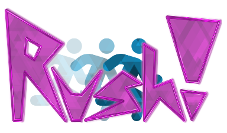

# Rush!
Custom ruleset for osu!lazer, based loosely on Muse Dash.

Demo: https://www.youtube.com/watch?v=HXdQd65CwkU

## Status
WIP but playable.

## Installation

Prebuilt binary releases are available if you're looking for testing the ruleset or don't possess a developpment environment:
| [Releases Page](https://github.com/swoolcock/rush/releases/) |
| -------------|

**NOTE**: osu!lazer runs custom rulesets only on desktop platforms (Windows, macOS, Linux) for the time being.

The ruleset consists of a single DLL file that you'll need to drop in the `rulesets` directory of osu!lazer data directory.

### Installation instructions

1. Navigate to the osu!lazer data directory. You can navigate to it by opening the settings panel on osu!lazer and clicking on the "open osu! folder" button. Alternatively you can directly navigate to the `rulesets` directory via your OS directory explorer at the following locations:
    - `%AppData%/osu/rulesets` on Windows
    - `~/.local/share/osu/rulesets` on Linux / mac OSX 

    **NOTE**: If you have relocated your osu! data directory to another directory, the `rulesets` directory will be there instead.

2. Drag and drop the ruleset's DLL file into the `rulesets` directory.

3. Have fun!
  If lazer was running while installing the ruleset, you may need to restart the game in order for the ruleset to appear in-game.

**NOTE**: Custom Rulesets do not automatically update alongside osu!lazer but have a compatibility mechanism to continue using them on newer game versions. However, some changes made game-side may break that compatibility and require installing a newer version of the ruleset.
Thus it is recommended that you periodically head over the releases page and replace the ruleset DLL in the `rulesets` directory with the latest available version.

## Map Translation
* Circles above half map height are converted to flying minions, below half are ground minions.
* Circles approximately mid map height are converted to double hits.
* Sliders are converted to note sheets in the same positional fashion as minions.
* Sliders with repeats add minions in the opposite lane of the note sheet at the start, end, and each repeat.
* Spinners are converted to minibosses.
* Circles with all of clap, whistle, and finish are converted to a sawblade in the opposite lane.

## TODO
* Installation instructions
* Better player sprite
* Rewinding
* Boss sprite during kiai sections
* Hammers and other minion variants
* Health pickups
* Custom avatars/abilities via mods?
